# Hi, I'm Jose Manuel Plaza Heras 👋

### Technology · Cybersecurity · Software Engineering · Quantum Computing

I'm passionate about understanding **how technology works beneath the surface** — from low-level programming and computer architecture to cybersecurity, data science, and quantum computing.

I believe the best way to learn technology is to **build things, break things, understand them, and build them better**.

---

## 👨‍💻 About Me

- 🔐 Interested in **Cybersecurity, Resilience, and Business Continuity**
- 💻 Exploring **Software Engineering and Low-Level Programming**
- 📊 Learning and building projects around **Data Science and Artificial Intelligence**
- ⚛️ Experimenting with **Quantum Computing and Quantum Algorithms**
- 🧠 Lifelong learner focused on understanding systems from first principles
- 🎓 Following the **Open Source Society University (OSSU)** Computer Science curriculum
- 🚀 Constantly building new projects to explore different languages, architectures, and technologies

---

## 🚀 Featured Projects

### 🕹️ ARM64 Pac-Man

A Pac-Man implementation developed in **ARM64 Assembly for Apple Silicon**, exploring low-level programming, computer architecture, graphics, memory management, and game logic.

### 🧩 Tetris

A systems-programming implementation of the classic game, designed as an experiment in low-level software development and computer architecture.

### ⚛️ Quantum Computing Experiments

Experimental projects using quantum computing frameworks to explore how quantum algorithms can be applied to real-world optimization, security, simulation, and computational problems.

### 🔐 Cybersecurity & Resilience

Projects and experiments related to cybersecurity, infrastructure resilience, risk analysis, disaster recovery, and business continuity.

> More experiments are always in progress.

---

## 🧠 Currently Learning

```text
Computer Science
├── Algorithms & Data Structures
├── Computer Architecture
├── Operating Systems
├── Programming Languages
└── Distributed Systems

Cybersecurity
├── Security Engineering
├── Infrastructure Security
├── Resilience
└── Business Continuity

Emerging Technologies
├── Artificial Intelligence
├── Data Science
└── Quantum Computing
```

---

## 🛠️ Technologies & Areas of Interest

### Languages & Development

`ARM64 Assembly` · `C` · `Python` · `Scala`

### Tools & Platforms

`Linux` · `macOS` · `Git` · `GitHub`

### Areas of Interest

`Cybersecurity` · `Computer Architecture` · `Software Engineering`

`Data Science` · `Artificial Intelligence` · `Quantum Computing`

`Algorithms` · `Business Continuity` · `Resilience`

---

## 📊 GitHub Stats

<p align="center">
  
</p>

---

## 💻 Language Stats

<p align="center">
  
</p>

---

## 🎓 Continuous Learning

I'm currently following the **Open Source Society University (OSSU)** Computer Science curriculum:

[](https://github.com/ossu/computer-science)

My goal is not simply to learn new technologies, but to understand the principles behind them and apply that knowledge through real projects.

---

## 🌐 Connect with Me

<p align="left">
  <a href="https://www.linkedin.com/in/josemanuelplaza/">
    
  </a>
</p>

---

<p align="center">
  <b>Always learning. Always building. Always curious.</b>
</p>

<p align="center">
  From bits to qubits.
</p>
